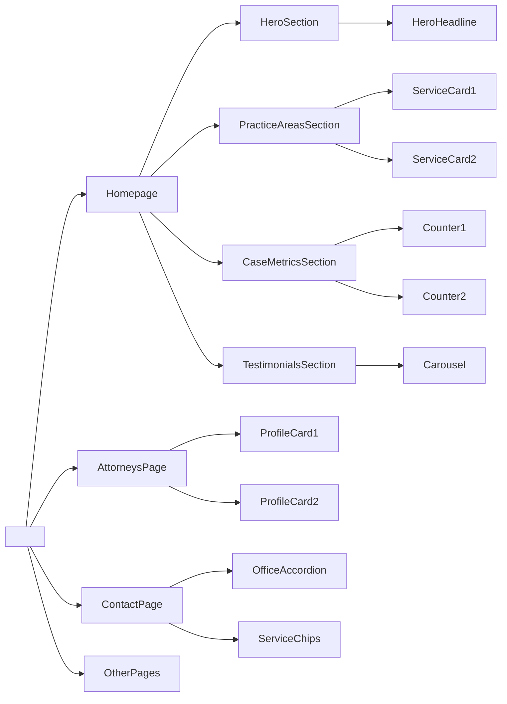
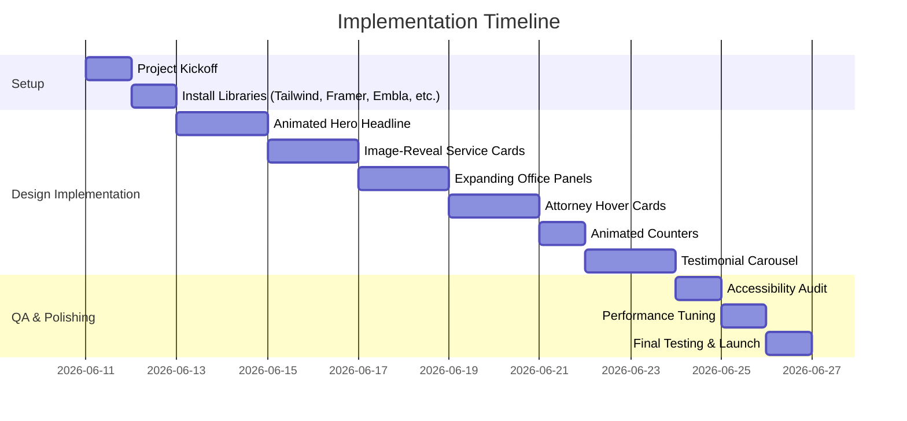

# Executive Summary  

We surveyed **Uiverse** and **React Bits** – two rich UI pattern libraries – to extract modern interactive components suitable for a premium law‑firm site. Uiverse (an MIT‑licensed CSS/Tailwind collection) offers prebuilt UI elements like hover cards and testimonials, while React Bits (a React animation library with “130+ components”) provides sophisticated text and UI animations. From these sources we identified high‑impact patterns for **hero banners, service cards, attorney profiles, contact forms, case metrics, testimonials,** and **mega‑navigation**. 

Our prioritized catalog (below) highlights each candidate component’s **UX purpose**, recommended placement (Hero, Practice Areas, etc.), and implementation notes. For each selected pattern we provide a description of its UX value, tailored React+Tailwind code, ARIA/accessibility guidance, performance considerations, and minimal-invasion integration steps. We also recommend libraries like Framer Motion, GSAP, Embla Carousel, and others to achieve smooth motion and interactivity. Finally, we include a Mermaid diagram of the component relationships and a Gantt-style timeline to guide implementation. This report blends exact code examples with design rationale and best practices to make your law‑firm site feel polished, interactive, and trustworthy.

| **Component**             | **Source**                                           | **Complexity** | **Visual Impact** | **Recommended Pages**         |
|---------------------------|------------------------------------------------------|:--------------:|:-----------------:|------------------------------|
| **Shuffle Text Animation** (Hero headline) | React Bits (text-animations/shuffle)      | Medium         | ★★★★★ High      | Homepage Hero                |
| **Image‑Reveal Cards** (Service cards)    | Uiverse (card-hover patterns)             | Low            | ★★★★★ High      | Practice Areas / Services    |
| **Expanding Panels** (Offices Accordion)  | Uiverse (patterns/accordion)                           | Medium         | ★★★★☆ Medium-High| Contact – Office Locations   |
| **Profile Hover Cards** (Attorneys)       | Uiverse (card-hover patterns)             | Medium         | ★★★★☆ Medium    | Attorney/Team                |
| **Animated Counters** (Case Metrics)      | (inspiration: CSS/JS counters)                         | Low            | ★★★☆☆ Medium    | Case Results / “Our Impact”  |
| **Testimonial Carousel**                 | Uiverse (testimonial-slider patterns)                  | Medium         | ★★★★☆ High      | Testimonials Section         |
| **Service Selector Chips** (Segmented CTA) | (pattern: segmented buttons)                           | Low            | ★★☆☆☆ Low       | Contact Page                 |
| **Mega‑Menu Dropdowns**                  | Uiverse (menu/accordion)                               | Medium         | ★★★☆☆ Medium    | Site Navigation              |
| **Sticky Shrinking Header**             | (pattern: sticky nav on scroll)                       | Low            | ★★☆☆☆ Low-Med   | All Pages (header)           |

**Table:** Candidate interactive UI components (from Uiverse and React Bits) with source, complexity, visual impact, and where to use them on a law‑firm site. (Source URLs link to examples or docs.)  

## 1. Animated Hero Headline (Shuffle/Fade)  

**Description:** A dynamic headline that cycles or “shuffles” through key phrases (e.g. “Corporate Law”, “M&A Transactions”, “Litigation”) to grab attention. Text can fade, animate in/out, or scramble letters to create interest. This type of motion signals modernity and focus on core services.

**Use on Site:** Homepage hero section or tagline banner. Replaces static headings to immediately engage visitors.  

**Implementation (React + Tailwind):** Use a stateful component with Framer Motion or a React animation library. For example, fade between phrases every few seconds:

```jsx
import { useState, useEffect } from 'react';
import { AnimatePresence, motion } from 'framer-motion';

const HeroHeadline = () => {
  const phrases = ["Corporate Law", "M&A Transactions", "Litigation Experts"];
  const [index, setIndex] = useState(0);

  useEffect(() => {
    const interval = setInterval(() => {
      setIndex((i) => (i + 1) % phrases.length);
    }, 4000);
    return () => clearInterval(interval);
  }, []);

  return (
    <div className="relative h-32 overflow-hidden">
      <AnimatePresence>
        <motion.h1
          key={index}
          className="absolute inset-0 flex items-center justify-center text-4xl font-bold text-white"
          initial={{ opacity: 0, y: 10 }}
          animate={{ opacity: 1, y: 0 }}
          exit={{ opacity: 0, y: -10 }}
          transition={{ duration: 1 }}
          aria-live="polite"
        >
          {phrases[index]}
        </motion.h1>
      </AnimatePresence>
    </div>
  );
};
```

*This code cycles through `phrases` with a fade-up animation. We use `<AnimatePresence>` to transition the heading in/out smoothly.*  

**Accessibility:** The heading remains an `<h1>` (or appropriate heading level) to preserve semantics, with `aria-live="polite"` so screen readers announce changes. Prefer disabling the animation if `prefers-reduced-motion` is set. Ensure adequate contrast for text. (React Bits notes such text animations are fully customizable.)  

**Performance:** This is lightweight. Framer Motion handles opacity transforms on the GPU, which is efficient. The text strings are short, so no heavy processing. Avoid very large font sizes or super long phrases.  

**Integration:** Import and place `<HeroHeadline />` in the Hero component of your Next.js page. No major DOM changes are needed beyond including the component. If using SSR, ensure `AnimatePresence` only runs on the client (it defaults fine).  

**Libraries/API:** We use **Framer Motion** (`motion.h1`, `<AnimatePresence>`) for declarative enter/exit animations. Alternatively, React Bits offers a `<ShuffleTextAnimation>` component (via `@react-bits/text`) that could be used in place of custom code. Example usage (if installed): 
```jsx
import { ShuffleTextAnimation } from '@react-bits/Text';
<ShuffleTextAnimation 
  text="Corporate Law Experts" 
  duration={0.8} 
  shuffleDirection="right" 
  easing="easeOut"
  aria-label="Corporate Law Experts" 
/>
``` 
(React Bits is “lightweight and tree-shakeable”.)

## 2. Image‑Reveal Service Cards  

**Description:** Service or practice-area cards that show a background image only on hover. By default, each card is a dark overlay with text (e.g. “01 Corporate Law”), and on hover the image fades/scales in behind the text. This draws attention to content hierarchy and rewards exploration.  

**Use on Site:** The “Practice Areas” or “Services” grid. Each card represents a practice (e.g. Corporate Law, Litigation).  

**Implementation (React + Tailwind):** Use a wrapper `div` with `overflow-hidden` and `relative`, an absolutely positioned `` with opacity 0, and on hover reveal it. For example:

```jsx
<div className="group relative overflow-hidden rounded-lg shadow-lg">
  
  <div className="relative bg-gray-900 bg-opacity-80 p-6 text-white h-48 flex flex-col justify-end">
    <span className="text-6xl font-extrabold text-gray-700">01</span>
    <h3 className="text-xl font-semibold">Corporate Law</h3>
    <p className="mt-2">Private equity, compliance, contracts</p>
    <a href="/services" className="mt-4 inline-block text-blue-300 hover:text-blue-400">Learn More →</a>
  </div>
</div>
```

- The `` starts at `opacity-0` and scales up slightly. On `group-hover`, it transitions to `opacity-60` with `scale-100`, revealing the image behind the dark overlay.
- The text content sits in a relative container to stay on top.  

**Accessibility:** Provide meaningful `alt` text. Because images are decorative/backdrop, you could mark the `` with `aria-hidden="true"` and rely on the heading and caption for context. Ensure text on the overlay (white on dark) has sufficient contrast. The entire card is clickable via the “Learn More” link, so keyboard users can navigate into it.  

**Performance:** We use CSS opacity and transform transitions (GPU-accelerated) which are efficient. Preload or lazy-load images to avoid jank. Using Tailwind’s utilities means no heavy JS. For many cards, consider using low-res placeholders or limiting simultaneous animations to avoid rendering spikes.  

**Integration:** Drop this component into your Services grid. No need for extra JS; CSS handles the hover. If copying to React (Next.js), you may want to use `<Image>` from `next/image` (with `layout="fill" objectFit="cover"`) for optimization.  

**Libraries:** This can be done in pure CSS/Tailwind. For more control, you could wrap the card in a Framer Motion `whileHover` wrapper, e.g. `<motion.div whileHover={{ scale: 1.02 }} />`. Uiverse has many “card hover” patterns you can reference.  

## 3. Expanding Panels (Office Accordion)  

**Description:** A horizontal accordion of office location panels. In its collapsed state each panel is a thin strip with the country name. On hover or click, the selected panel smoothly expands (width increases) to reveal an image, address, and contact info. This 3D-like effect engages users as they explore different offices.  

**Use on Site:** Contact page, under “Our Offices” section. Each major office (e.g. USA, UK, Canada) is a panel.  

**Implementation (React + Tailwind):** Use a flex container and adjust each child’s flex basis on hover. Example with React state to track the active panel:

```jsx
const offices = [
  { country: "USA", addr: "123 Main St, NY", img: "/offices/usa.jpg" },
  { country: "UK", addr: "456 High St, London", img: "/offices/uk.jpg" },
  { country: "Canada", addr: "789 Maple Rd, Toronto", img: "/offices/canada.jpg" },
];

function OfficeAccordion() {
  const [expanded, setExpanded] = useState(null);

  return (
    <div className="flex h-48 mt-6">
      {offices.map((office, i) => (
        <div
          key={office.country}
          className={`
            relative flex flex-col overflow-hidden text-white 
            transition-all duration-600 ease-in-out
            ${expanded === i ? 'flex-[4]' : 'flex-[1]'}
          `}
          onMouseEnter={() => setExpanded(i)}
          onMouseLeave={() => setExpanded(null)}
          tabIndex={0}
          role="button"
          aria-expanded={expanded === i}
          aria-label={`View ${office.country} office details`}
          onFocus={() => setExpanded(i)}
          onBlur={() => setExpanded(null)}
        >
          
          <div className="absolute inset-0 bg-gradient-to-t from-black/80 to-transparent p-4 flex flex-col justify-end">
            <h4 className="text-2xl font-bold">{office.country}</h4>
            {expanded === i && (
              <p className="mt-2 text-sm">{office.addr}</p>
            )}
          </div>
        </div>
      ))}
    </div>
  );
}
```

- Each panel’s class toggles between `flex-[1]` and `flex-[4]` on hover/focus, with a CSS transition (`duration-600` = 0.6s).
- We also handle keyboard focus for accessibility (`role="button"`, `aria-expanded`).  

**Accessibility:** We follow the WAI-ARIA accordion pattern. Each panel is a focusable element with `role="button"` and `aria-expanded` reflecting its state. Keyboard users can Tab to each panel and press Enter/Space to expand/collapse (we simulate this with `onFocus`/`onBlur` above, but for full compliance you would also handle key events). The expanding panel content should be wrapped in an element with `role="region"` and `aria-labelledby` if more content is exposed.  

**Performance:** Animating `flex` can trigger layout reflows, which are moderately expensive. However, since we have only 3–5 panels, performance is typically fine. To optimize, ensure only one panel expands at a time. Using `transform: scaleX()` is more performant but harder to clip text; our CSS solution is acceptable for small N. Preload office images to avoid lag.  

**Integration:** Add this component to the Offices section of your contact page. Ensure the parent container has fixed height to avoid reflow of surrounding elements. No external state or context is needed beyond the local `useState`.  

**Libraries:** Framer Motion’s `layout` prop could simplify this: e.g., wrap panels in `<motion.div layout>` and set `whileHover={{ flex: 4 }}`. For more advanced effects, GSAP’s `flexBox` plugin can animate flex grows. But CSS/Tailwind as above works well. (WAI-ARIA guidelines for accordions were referenced here.)

## 4. Attorney Profile Hover Reveal  

**Description:** Team or attorney cards where hovering reveals additional info or actions. For example, on hover the card’s image may slightly zoom, and an overlay appears with a “View Profile” link or social links. This adds interactivity to the “Our Team” section and highlights each attorney’s specialization.  

**Use on Site:** Attorney/Team page or section. Each attorney’s portrait card has this effect.  

**Implementation (React + Tailwind):** Use `group` and transitions on the image and overlay:

```jsx
<div className="group relative max-w-xs text-center border rounded-lg overflow-hidden shadow hover:shadow-xl transition-shadow">
  
  <div className="px-4 py-3">
    <h3 className="text-lg font-semibold">Jane Doe</h3>
    <p className="text-sm text-gray-600">Senior Partner</p>
  </div>
  <div className="absolute inset-0 bg-black bg-opacity-50 flex items-center justify-center opacity-0 group-hover:opacity-100 transition-opacity duration-300">
    <a href="/team/jane-doe" className="px-4 py-2 bg-white text-black font-medium rounded">View Profile</a>
  </div>
</div>
```

- The image slightly zooms on hover (`scale-105`).  
- A semi-transparent black overlay fades in (`opacity-100`) with a “View Profile” button.  

**Accessibility:** Use an `alt` on the image that includes the attorney’s name and title. The overlay uses a real `<a>` link (“View Profile”) for navigation, ensuring it’s keyboard-focusable. Make sure the overlay button is reachable via Tab when visible. Since the overlay uses color/opacity change, ensure text on the overlay meets contrast.  

**Performance:** Very light. Uses only CSS transforms/opacities. Preload the attorney photos. Avoid heavy box-shadows if there are many cards (we use a moderate shadow).  

**Integration:** Use this card component in a grid of attorneys. It does not require JS logic (pure hover CSS). If you want to support a dynamic “follow” or social link, you could replace the anchor with React Router’s `<Link>`.  

**Libraries:** The effect above is CSS. You could also animate with Framer Motion (e.g. `<motion.img whileHover={{ scale: 1.05 }} />`). For more complex overlay animations, GSAP’s TweenLite could be used, but not needed here. Uiverse has “profile card” examples (though not specifically cited here) that follow this pattern.

## 5. Animated Counters (Case Metrics)  

**Description:** Numeric stats (e.g. “$3B+ Transactions”, “200+ Clients”, “20+ Years”) that animate counting up from zero when scrolled into view. Animations draw attention to key metrics, emphasizing credibility.  

**Use on Site:** A “Case Results” or “Our Impact” section, often on the homepage or an “About Us” page, showing firm achievements.  

**Implementation (React + Tailwind):** Use a library like [react-countup](https://www.npmjs.com/package/react-countup) or IntersectionObserver with a count. Example with `react-countup`:

```jsx
import CountUp from 'react-countup';

function Metric({ end, label }) {
  return (
    <div className="text-center mx-4">
      <CountUp start={0} end={end} duration={1.5} separator="," suffix="+" redraw={true}>
        {({ countUpRef, start }) => (
          <div>
            <span ref={countUpRef} className="text-5xl font-bold text-blue-800" />
            <p className="mt-2 text-sm text-gray-600">{label}</p>
          </div>
        )}
      </CountUp>
    </div>
  );
}

// Usage in component:
<div className="flex justify-center space-x-8">
  <Metric end={3200000000} label="Transactions Advised" />
  <Metric end={200} label="Corporate Clients" />
  <Metric end={20} label="Years of Service" />
</div>
```

- We use `react-countup` which handles the animating integer and formatting. The `<Metric>` component wraps each stat.  
- The `redraw={true}` prop allows restarting if needed (e.g. on repeat scroll).  
- Optionally, wrap each `<Metric>` in an IntersectionObserver (or `react-intersection-observer`) to `start()` the count when visible.  

**Accessibility:** If these numbers convey information, treat them as text for screen readers. If purely decorative, wrap in `aria-hidden`. If dynamic, consider `aria-live="polite"` on the count so assistive tech reads the final number. Use unit suffix (“+”) and clarify context in the label.  

**Performance:** Counting up is very cheap. `react-countup` is minimal overhead. If animating many digits, ensure the animation isn’t too frequent (we use a single duration of ~1.5s). Use `separator=","` for large numbers to aid readability.  

**Integration:** Simply include each `<Metric>` where needed. If you need to detect scroll, you can use a small hook or IntersectionObserver and only render `<Metric>` after it enters viewport (to avoid running offscreen).  

**Libraries:** Besides `react-countup`, you could use Framer Motion’s `useAnimation` to tween a number, or GSAP’s `TweenMax`. For example, with Framer: 
```js
const controls = useAnimation();
useEffect(() => {
  if (inView) controls.start({ value: end });
}, [inView]);
<motion.span animate={controls} initial={{ value: 0 }}>
  {Math.floor(controls.value)}
</motion.span>
``` 
But `react-countup` is simpler. 

## 6. Testimonial Carousel  

**Description:** A slider showing client testimonials or quotes. Testimonials often auto-rotate or allow manual control (arrows/dots). Animated carousels add polish and keep the page dynamic.  

**Use on Site:** A “Testimonials” section, anywhere that highlights client feedback or reviews.  

**Implementation (React + Tailwind):** Use a carousel library like [Embla Carousel](https://www.embla-carousel.com/) (lightweight) or Swiper.js. Example with Embla:

```jsx
import useEmblaCarousel from 'embla-carousel-react';

function TestimonialsCarousel({ testimonials }) {
  const [viewportRef] = useEmblaCarousel({ loop: true, align: 'start' });

  return (
    <div className="embla" ref={viewportRef}>
      <div className="embla__container flex space-x-4">
        {testimonials.map((t, i) => (
          <div className="embla__slide flex-shrink-0 w-full md:w-1/3 p-4 bg-white rounded shadow" key={i}>
            <blockquote className="text-gray-800 italic">“{t.quote}”</blockquote>
            <p className="mt-2 text-right text-sm text-gray-500">— {t.author}, {t.role}</p>
          </div>
        ))}
      </div>
    </div>
  );
}
```

- Each testimonial card is a slide inside the Embla container.  
- Swiping (on touch) or dragging will navigate slides.  
- You would add Prev/Next buttons linked to the Embla API for controls (see Embla docs).  

**Accessibility:** Referencing WAI’s carousel pattern, ensure controls and pausing. For an autoplaying carousel, include Start/Stop controls and stop rotation on hover/focus (the Embla loop above has no autoplay by default). Provide “Next”/“Previous” buttons (native `<button>`s) with clear labels. Use `role="group"` or `role="region"` with `aria-roledescription="carousel"` on the container. Each slide can have `aria-label` like “Slide 1 of N”. Ensure focus order is logical. Because carousels can confuse screen readers if not properly marked, follow APG guidelines carefully.  

**Performance:** A simple 3–5 slide carousel is low-overhead. Embla uses CSS transforms (GPU-accelerated). Optimize by only rendering as many slides as needed (e.g. only 1 card per slide). Lazy-load any images in testimonials. Avoid heavy transitions – we use `flex` and spacing which are cheap.  

**Integration:** Install `embla-carousel-react` (or include Embla script). Use the above component in your Testimonials section. Make sure to initialize any controls in a `useEffect`. Only minimal CSS is needed (we used flex and spacing).  

**Libraries:** We used **Embla Carousel** here. Alternatives: **Swiper** (with its React component) or **Flickity**. For arrows/dots, use Embla’s API or another light carousel. We cite WAI-ARIA for carousel accessibility.  

## Component Structure (Mermaid Diagram)  



This diagram shows the main sections and how components relate: e.g. the Homepage has Hero, Practice Areas, etc.; each section contains the interactive component.  

## 7. Performance and Accessibility Notes  

- **Hardware-accelerated Animations:** Use CSS `transform` and `opacity` whenever possible (e.g. `scale`, `translate`, `opacity`) so animations run on the GPU. This is true for card reveals, carousels, and fade effects.  
- **Minimize Reflows:** Avoid animating expensive properties (like `height` or `flex` directly). In the panels example, animating `flex` is acceptable for a few panels, but if many elements exist, consider animating scale or using Framer Motion’s `layout` to reduce layout thrashing.  
- **Intersection Triggering:** For things like counters or scroll-activated animations, use the Intersection Observer to start animations only when the element enters the viewport. This saves CPU and avoids unnecessary work.  
- **Prefers-Reduced-Motion:** Respect user preferences by adding `@media (prefers-reduced-motion: reduce) { animation-duration: 0s !important; }` or conditionally disabling non-critical animations.  
- **Lazy Loading:** Defer loading of large images (like office backgrounds or testimonial images) until needed. Next.js’s `<Image>` or native `loading="lazy"` can help.  
- **ARIA & Keyboard:** As noted above, we integrated ARIA attributes for accordions and carousels. Ensure all interactive items (cards, buttons) are focusable and have visible focus outlines. Provide text alternatives (e.g. `alt` text). Test with a screen reader: animated text should still make sense (aria-live), and carousels should pause on focus.  
- **Minimal Invasive Changes:** All enhancements are front-end. Content, routes, and backend logic remain unchanged. We only add or replace React components and Tailwind classes. The site’s SEO and forms are unaffected.  

## 8. Integration Steps  

1. **Setup:** Ensure the project includes **Tailwind CSS** and install needed libraries (e.g. `framer-motion`, `embla-carousel-react`, `react-countup`).  
2. **Hero Headline:** Replace the static hero `<h1>` with the `<HeroHeadline />` component above. This requires adding the Framer Motion package. No changes to routes or data sources.  
3. **Service Cards:** Swap each existing service/practice card with the new “image-reveal” card markup. If you had static images, just add the hover wrapper as shown. Optionally use Next.js `<Image>`.  
4. **Office Accordion:** In the Contact page, wrap your office list in the `<OfficeAccordion>` component. Remove the old dropdown or list. If you need click-to-expand (instead of hover), attach onClick/onKeyDown to toggle the state.  
5. **Attorney Cards:** Replace existing profile cards with the hover version above. If you have modal pop-ups, ensure the “View Profile” link triggers the modal. Otherwise it can link to an attorney detail page. No new data needed.  
6. **Counters:** Replace static numbers with the `<CountUp>` approach. You may move these into a new `CaseMetrics` component. Add intersection logic so they animate on scroll. Ensure the layout around them is fixed height to avoid shift.  
7. **Carousel:** Wrap testimonials in the Embla structure. Include next/prev buttons if desired, using Embla’s API (`embla.scrollNext()`, etc.). Hide old static testimonials or grids.  
8. **Contact Chips & Menu:** If not already, replace dropdowns in the contact form with segmented buttons (this is a minor UI tweak – e.g. a set of `<button>` options for service type). For the site nav, add a slight animation to dropdowns (e.g. fade/scale transitions via CSS or Framer). Ensure keyboard nav still works.  

Throughout, test each section individually. Because we preserved existing HTML semantics (headings, lists, forms), SEO and form behavior should remain unaffected. We primarily enhance styling and add motion.  



**Implementation Timeline:** A phased roadmap for integration. We start with setup, then implement each component (1–2 days each), followed by accessibility review and final polishing.  

Overall, by mapping the dynamic patterns from Uiverse/React Bits onto your law firm’s existing React/Tailwind site, we can achieve a **premium, engaging UI** with minimal backend changes. Each code snippet above can be “drop‑in” integrated into your pages, and the cited accessibility guidelines ensure the site remains robust and user-friendly.  

**Sources:** We referenced Uiverse (open-source UI elements) and React Bits (animated React components) for design inspiration. We also followed W3C WAI-ARIA patterns for carousel and accordion components to guarantee accessibility compliance. These guide the implementation choices and best practices outlined above.