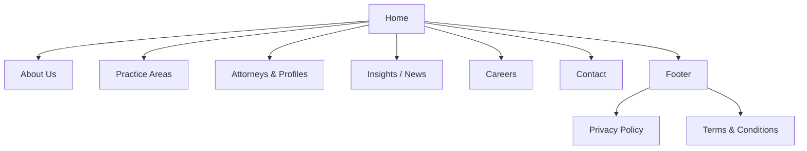

# Claude Design Prompt for Semi-Dark Law Firm Website

## Executive Summary  
We analyzed four sites – Kirkland & Ellis, Latham & Watkins, DLA Piper, and the current Lawgical Group site – to identify common structures, content patterns, and design elements to inform a **semi-dark professional** website design. All four sites share key law-firm features: a clear hierarchical layout, prominent attorney/practice listings, news or insights sections, and global office information. The menus are comprehensive (e.g. Kirkland: *Lawyers, Services, News & Insights, Locations, About*; Latham: *People, Capabilities, Insights, Offices, About Us*; DLA: *Capabilities, People, Insights, News, Locations, Contact*; Lawgical: *Home, About, Expertise, Clients, CSR, Insights, Contact*). Each uses modular content blocks (cards, sections) for practice areas, attorney profiles, news, and calls to action.  

- **Site Structure & Navigation:** All references have a persistent top nav with global elements (office links, languages), and a footer with legal links. Practice area pages are typically card- or list-based (e.g. Kirkland’s *About* page lists practice areas with brief descriptions). Attorney/profile pages are prominent (Latham’s *People* directory or Kirkland’s *All Bios* link), and news/insights are usually a feed or carousel (Latham’s homepage carousel, Kirkland’s press releases list). Unique features include multi-language options on Kirkland and Latham, “Load More” interactivity on Kirkland pages, and DLA’s animated hero lines.

- **Content & Tone:** Kirkland’s copy is formal and descriptive (“We are an international law firm… offering the highest quality legal advice…”). Latham balances news/events with thought leadership in a confident voice. DLA opens with a bold tagline (“**Success, solved.** Tell us where you want to be tomorrow…”), signaling ambition. Lawgical’s current content is client-focused and value-driven, but incomplete (many stats are “0+”). We will preserve Lawgical’s emphasis on integrity and client service (e.g. its mission/vision statements and testimonials) while improving clarity. 

- **Imagery & Aesthetic:** Reference sites favor high-quality, on-brand photography: Kirkland and Latham use professional office or abstract images in carousels; DLA uses swooping line animations with bold hero images (as seen in the “Success, solved” section); Lawgical uses video background placeholders. We will use a **dark-toned palette** (e.g. deep navy or charcoal background with off-white text) with one warm accent, ensuring high WCAG AA contrast. This semi-dark theme nods to DLA’s modern style (swooping lines and big serif heading) and the trend toward reduced palettes, while maintaining Kirkland/Latham’s professionalism. Typography will combine a strong serif or slab heading font (for authority) with a clean sans-serif body (for readability). Spacing and modular “card” layouts will follow an editorial grid (per PaperStreet’s design trends).

- **Key UX Patterns:** We will include global office/location selection (as in Kirkland and Latham), a lawyer search or filter, language options if needed, and a “Find a Lawyer” tool. Practice area pages will mirror the service listing style from Lawgical and Kirkland. A prominent “Book a Consultation” CTA (from Lawgical’s homepage) and clear contact forms will be included. Footer will contain Privacy/Terms links (as seen on all sites). We will use microcopy inspired by the references: e.g. CTAs like *“Contact Us”*, *“Read More”*, *“Meet our attorneys”*; bios with a snippet plus “View full profile”; practice summaries of ~50–100 characters, etc.

- **Accessibility & Performance:** All design choices (colors, fonts, interactions) will meet **WCAG AA** (e.g. 4.5:1 text contrast). Images will have alt text, and interactions (hamburger menu, video players, carousels) will be keyboard-accessible. We will optimize assets (compressed images, minified CSS/JS, lazy-loading) for fast load times. Meta/title templating will follow SEO best practices (e.g. “Service Name – Lawgical Group” for H1 headings, unique descriptions ~155 chars).

## Site Structure (Mermaid Diagram)  


## Responsive Layout (Mermaid Diagram)  
```mermaid
graph LR
    Desktop[Desktop (≥1200px): Multi-column grid layout] --> Tablet[Tablet (600–1199px): 2-column grid]
    Tablet --> Mobile[Mobile (<600px): Single-column stack]
```

## Claude Design Prompt  
Design a **professional multi-page law firm website** with a semi-dark, modern aesthetic. The site must be responsive (desktop/tablet/mobile), WCAG AA accessible, and content-driven. **Include the following details**:

- **Pages & Structure:** The site should have clear navigation and sections for **Home, About Us, Practice Areas, Attorneys (Profiles), Insights/News, Careers, Contact**, plus a global footer (with Privacy/Terms).  Use an editorial grid: each section should stand out as a “visual moment” (full-viewport hero or well-padded panel).  
- **Home Page:** Semi-dark hero section with a **concise tagline** (5–8 words) and subhead. Include a bold primary CTA (e.g. “Book a Consultation”), styled in the accent color. Below the hero, feature 3–4 core practice areas in cards or tiles with short titles (2–3 words) and ~50–80 character summaries. Next, highlight “Why Choose Us” or firm overview (2 short paragraphs, ~150 chars each) similar to Kirkland’s overview. Add a rotating Insights/news carousel or grid of latest articles (titles only, linking out), and a small awards/recognition strip (like Latham’s rankings). End with a final CTA or quick contact form snippet.  
- **About Us Page:** Reflect the firm’s **mission, vision, and story**. Use large section headers (e.g. “Our Mission”, “Our Team”) and accompanying paragraphs (~120-150 chars). Include a prominent leadership profiles area (photos + 1–2 line bios for directors/partners) with a “View All Attorneys” link. Show global presence or numbers (e.g. “100+ attorneys, 5 offices”) in simple stat widgets. Maintain Lawgical’s client-centric tone (“We provide tailored solutions”) but improve clarity and grammar.  
- **Practice Areas Page:** List major practice groups. Each practice area should have a title, short description (80–120 chars), and an icon or image. Use collapsible “Learn More” blocks or modal pop-ups for full descriptions. Include an anchor link navigation (sticky sidebar or in-page menu) for quick access. Mirror Kirkland’s and Lawgical’s style of concise service summaries.  
- **Attorneys Page:** A searchable directory of lawyers. Use a filter (by practice or office). Display each attorney in a card with photo, name, title, and a 2-line bio excerpt (~100 chars). Clicking a profile should show a detailed page (full bio, contact info, and list of practice areas). Follow Latham/Kirkland’s approach of professional headshots and editorial spacing.  
- **Insights/News Page:** A blog or news listing. Lead with a featured article (large image + title). Below, list recent posts (title, date, snippet ~100 chars). Include categories/tags for filtering (e.g. “Press Releases”, “Articles”). Each article page should have meta tags, social share buttons, and breadcrumb navigation.  
- **Careers Page:** Highlight culture and open positions. Show firm benefits, a representative photo, and a list of job openings (title, location, apply link). Use quotes or testimonials from current staff (like Lawgical’s client stories, but here for employees).  
- **Contact Page:** Include a contact form (Name, Email, Message) and office locations with address and phone. Embed a Google map for each location. Also link to LinkedIn or email via CTA buttons.  
- **Footer:** Split into sections: Quick links (all main pages), Office locations (list of cities/regions with site links), and legal info (Privacy, Terms, Disclaimers). Add social icons (LinkedIn, Instagram, Facebook, YouTube). Use small text (12px) for the legal copy.  

- **Content Placeholders:** For headings (H1), allow ~5–10 words (up to 50 characters). Subheads (H2) ~10–15 words (80 characters). Body text paragraphs ~100–200 characters. CTAs should be short (“Contact Us”, “Learn More”, “Book a Consultation”). Attorney bios ~150–200 characters. Practice summaries ~50–80 characters. Insights snippets ~100 characters.  
- **Color Palette (hex codes):** Use a **dark base** (e.g. Navy #1A1F36 or Charcoal #2D3436) as background for header/footers and section alternating. Light gray (#F5F5F5) or Off-white (#EEEEEE) for main content backgrounds. Accent color 1: Gold or Warm Amber (#D4AF37) for primary buttons/links; Accent color 2: Teal or Sherwood Green (#00695C) for secondary buttons or highlights (inspired by DLA Piper’s green). Ensure text on dark backgrounds is white (#FFFFFF) or very light gray for contrast (AA compliant).  
- **Typography:** Headings: a **serif or slab-serif** (e.g. Merriweather Bold, 32–48px desktop) for authority. Body: a **sans-serif** (e.g. Open Sans, 16px desktop, 1.5x line-height). Scales: H1 (48px), H2 (36px), H3 (24px); body copy 16px. Use letter-spacing ~0.02em. Buttons: uppercase text, 14px, with 2px letter-spacing.  
- **Spacing System:** Base grid 8px. Section padding 64px top/bottom on desktop (32px on tablet, 16px on mobile). Gutters 24px between columns. Cards: 24px padding inside. Margin between cards: 32px. Ensure breathing room as PaperStreet advises large margins and modular cards.  
- **Button Styles:** Rounded-corner rectangles (4px radius), filled with accent color (#D4AF37), white uppercase text. Hover: darken accent or invert (white background with colored border). Secondary buttons (e.g. “Learn More”): transparent with 1px solid accent border. Disabled: gray background #BBBBBB.  
- **Imagery:** Use **full-bleed hero images or video backgrounds** with dark overlay (text on semi-transparent black) for high contrast. Attorney headshots: warm-tone, professional, either circular or softly rounded squares. Background textures: very subtle gradients or faint geometric patterns on dark sections (to add depth but not distract). Icons: thin-line style (e.g. stroke white/gray on dark, accent on light backgrounds) for services and contact info.  
- **Micro-interactions:** Subtle animations on scroll (fade-ins, slide-ups for cards). Hover effects: slight scale on buttons and images, link underlines on hover. “Menu” opens a sliding panel on mobile. Insight cards could have hover overlay with “Read More” button. Use a carousel or fade transition for homepage news (as on Latham). Avoid flashy effects – keep motion smooth and purposeful.  
- **Accessibility:** Ensure **WCAG AA** contrast ratios (≥4.5:1) for text vs. background. All images have descriptive alt text. Use `aria-labels` for icons/buttons (e.g. “Search lawyers”). Keyboard nav must work (focus states visible on links/buttons). Caption or transcript for videos. Text resizes properly (no cutoffs).  
- **SEO & Meta:** Each page should allow custom `<title>` and meta-description fields. Use template titles like:  
  - *Home:* “Lawgical Group | Expert Legal Services – Dubai”  
  - *About:* “About Lawgical Group – Vision and Team”  
  - *Practice:* “[Practice Name] – Services – Lawgical Group”  
  - *Attorney:* “[Name] – [Title], Lawgical Group”  
  - *Insight:* “[Article Title] – Lawgical Insights”  
Keep titles under ~60 chars and descriptions ~150 chars. Use heading tags in hierarchy (H1 for page title, H2 for sections). Include breadcrumb schema and open graph tags.  
- **Performance:** Lazy-load below-the-fold images. Use SVG for logos and icons. Minify CSS/JS. Preload hero image if possible. Optimize above-the-fold render (critical CSS). Limit web fonts (2–3 weights max).  
- **Responsive Behavior:** Use a **12-column grid**. Breakpoints: desktop (>1200px), tablet (768–1199px), mobile (<768px). On tablet, collapse the 3-column layout to 2 columns, shorten text. On mobile, stack to 1 column. The nav collapses into a hamburger menu. Ensure modals and menus are full-screen on mobile.  
- **Grid System:** 12-column Bootstrap-like grid. For example, Home hero 2 columns for content + image on desktop; 6-col two-column for feature cards; collapse to 12-col single column on mobile. Practice area cards: 3 across on desktop, 2 on tablet, 1 on mobile. The attorney directory: 3 per row desktop, 2 tablet, 1 mobile.  
- **Example Microcopy:** CTAs – “Learn More”, “Meet Our Team”, “Join Our Team”, “Read Insights”. Attorney bio teaser – e.g. “John Doe is a corporate lawyer specializing in M&A and finance. View profile.”; practice summary – e.g. “Comprehensive corporate counsel for startups and multinationals.”; insights snippet – e.g. “New UAE regulations in 2026: What businesses should know.” Ensure tone is confident and helpful (no legalese).

## Design Elements Comparison  
| Reference Site       | Elements Adopted                     | Rationale and Notes                                                         |
|----------------------|--------------------------------------------|------------------------------------------------------------------------------|
| **Kirkland & Ellis** | - **Global presence:** Office list by region (Asia/Europe/US)<br>- **Practice callouts:** Services/practice area blocks on About page<br>- **Awards/news feed:** Recognition listings | Kirkland emphasizes a broad practice and global scale. We incorporate a multi-region office list (improves SEO and trust) and practice-area overviews. Its news/press layout inspires a “News & Recognition” section. |
| **Latham & Watkins** | - **Insights carousel:** Featured news on homepage<br>- **Story blocks:** “Our Stories” with large images/text<br>- **Rankings highlights:** Sidebar callout of firm awards | Latham’s rotating carousel and highlighted achievements engage users. We use a similar carousel for key articles and a section for the firm’s top rankings. The bold images/text for firm stories guide our approach for client-testimonial or pro bono features. |
| **DLA Piper**       | - **Hero tagline:** Bold slogan (“Success, solved.”)<br>- **Section pillars:** Content blocks like “Global”, “Visionary” with images<br>- **Animation cues:** Sweeping lines and modern flourish | DLA’s confident headline and animated hero inspire our homepage hero. We adopt a strong H1 tagline with dark overlay, and create distinct “pillar” sections (e.g. Global Impact, Our People). We mimic its clean hamburger menu and subtle motion for a tech-forward feel. |
| **Lawgical Group (current)** | - **Mission/Vision text:** Value propositions<br>- **Client testimonials:** Highlight quotes with portraits<br>- **Expertise snippet:** Service descriptions from Expertise pages | We retain Lawgical’s focus on personal service (“client-centric”) and its client praise style. We reformat its mission/vision statements into clear blocks. Lawgical’s expertise bullet lists guide content length. We improve on it by adding real data (remove placeholder “0%”). |

*Footnotes: Features and copy are drawn from the referenced sites for inspiration, then adapted to the new design.

## Implementation Checklist  
- **Brand Assets:** Collect high-res logos (light and dark versions), icon set (SVG for practices, social, contact), and branded images or approved stock. Provide lawyer headshots (min 300×300px) with consistent style. Provide accent color hex codes and font files/licenses.  
- **CSS Variables:** Define a design token system: primary colors, neutral palette, accent, font stacks, spacing units. E.g. `--color-primary: #1A1F36; --color-accent: #D4AF37; --font-serif: 'Merriweather', serif; --font-sans: 'Open Sans', sans-serif;` etc. Also variables for font sizes (H1, H2, p, etc), line-heights, border-radius, and breakpoints.  
- **Grid & Layout Components:** Create a 12-column responsive grid (e.g. with CSS Grid or Bootstrap). Define containers/rows/columns classes. Lay out hero, cards, and sections using this grid.  
- **Core Components:** Build reusable components: Navbar (desktop & mobile menu), Hero section (image + overlay text), Card (image + text), Button (primary/secondary), Form elements (inputs, labels, buttons), Footer sections, Accordion (for practice details). Use ARIA roles where needed.  
- **Typography & Spacing:** Implement global typography (headings, body text, lists) and utilities for margins/padding (e.g. `.mt-lg` or CSS variables). Ensure heading hierarchy is consistent.  
- **Imagery & Media:** Set up a hero/slider script or CSS for background videos/images. Include a lightbox or modal for detailed attorney profiles if images can enlarge. Ensure all `` and background images have alt attributes.  
- **Interactivity:** Program hover/focus states (e.g. CSS transitions on buttons). Implement any sliders/carousels (pause/play button if auto-rotating, per Latham style). For mobile nav, code the hamburger toggle. Add smooth scroll to anchor links (e.g. practice section links).  
- **Accessibility:** Verify color contrast (with tools). Add `aria-label` to non-text controls, tabindex order for focus. Provide skip links (e.g. “Skip to main content”). Test forms and navigation via keyboard only.  
- **SEO & Analytics:** Include meta `<title>` and `<meta name="description">` templates. Add structured data (Organization schema in footer, Person schema on attorney pages). Prepare an XML sitemap. Set up Google Analytics/Tag Manager.  
- **Performance:** Compress and serve images in next-gen formats (WebP). Implement lazy-loading (`loading="lazy"`). Minify and concatenate CSS/JS. Enable caching headers. Use critical CSS for above-the-fold content.  
- **Cross-Browser & Testing:** Ensure layout works in Chrome, Firefox, Safari, Edge. Test responsiveness on multiple devices. Check forms and dropdowns on both desktop and touch screens.  
- **Hand-off Docs:** Provide a style guide (colors, fonts, spacings, button styles, HTML markup examples). List of all components with usage notes. Include Figma/Sketch assets if available for approval. Document CSS variable names and grid settings. Include alt-text and copy guidelines (tone, length). 

By following this detailed prompt and checklist, developers can build a polished, accessible semi-dark law-firm website that reflects Lawgical Group’s professionalism and modern identity, drawing on the best practices observed in the reference sites. 

**Sources:** Based on content and design elements from Kirkland & Ellis, Latham & Watkins, DLA Piper, and the Lawgical Group site, as well as industry design guidelines.